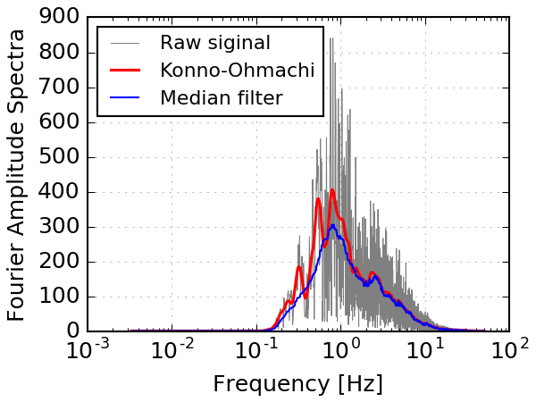
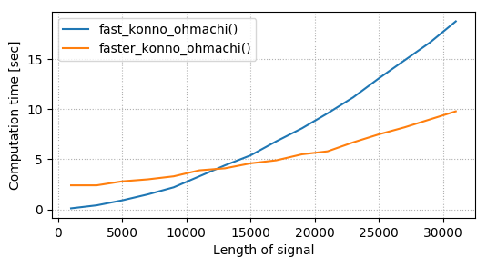

# _Fast_ Konno-Ohmachi smoothing
#### This is a Python module that performs Konno-Ohmachi spectral smoothing very fast (reduces running time by ~60%).

## Description
Konno-Ohmachi is a smoothing algorithm proposed by Konno & Ohmachi (1998) [[Abstract](http://bssa.geoscienceworld.org/content/88/1/228.short), [PDF](http://www.eq.db.shibaura-it.ac.jp/papers/Konno&Ohmachi1998.pdf)], which achieves a "uniform-span" smoothing to frequency spectra in logarithmic scale.

For lower frequencies, the Konno-Ohmachi smoothing window is narrower (i.e., less smoothing), and for higher frequencies, the window is wider (i.e., more smoothing). "Conventional" smoothing filters use same smoothing window widths at all locations. This feature of the Konno-Ohmachi filter is preferred in engineering seismology, where the variations of amplitudes in lower frequencies (< 10 Hz) are more important than in higher frequencies.

The figure below shows the result of Konno-Ohmachi filter versus a "conventional" median value filter [[Wiki](https://en.wikipedia.org/wiki/Median_filter)]. The two filters yield similar results for frequency > 5 Hz, but for lower frequencies, the median filter over-smoothes the raw spectrum, which is undesirable.


###### (The raw signal used in this example is the Fourier amplitude spectrum of a ground acceleration waveform recorded during 2011/3/11 Magnitude-9.0 Tohoku-Oki Earthquake.)

## Computation speed
Konno-Ohmachi filter is time-consuming due to varying window widths. This module stores pre-calculated smoothing window values, which, compared to other ordinary Konno-Ohmachi smoothers, reduces the calculation time by ~60% (hence the "fast" in the module name).

## Subroutines

This module has three subroutines:

+ `fast_konno_ohmachi()`: the "fast" method, using single CPU core;
+ `faster_konno_ohmachi()`: the "faster" method, using multiple CPU cores;
+ `slow_konno_ohmachi()`: the "slow" method, which does not use pre-calculated smoothing window.

## How to use this module
Put `konno_ohmachi.py` in your Python search path. Then,

```python
import konno_ohmachi as ko
smoothed = ko.fast_konno_ohmachi(spectrum,freq,smooth_coeff=40,progress_bar=True)
```

or (the "faster" function, using multiple CPU cores):

```{python}
smoothed = ko.faster_konno_ohmachi(spectrum,freq,smooth_coeff=40,n_cores=4)
```

See `Demo_konno_ohmachi_smooth.py` for more detailed examples.

## Notes on parallel computing

The `faster_konno_ohmachi()` function uses multiple CPU cores, but it is not necessarily faster than `fast_konno_ohmachi()`, because the data I/O between the CPU cores takes extra time ("computation overhead"). Below is a benchmarking of the running time for input signals with different length:

```
| Length of signal | Time ("fast")  | Time ("faster")  |
| ---------------- |:--------------:| ----------------:|
|     1000         |    0.1 sec     |     2.4 sec      |
|     3000         |    0.4 sec     |     2.4 sec      |
|     5000         |    0.9 sec     |     2.8 sec      |
|     7000         |    1.5 sec     |     3.0 sec      |
|     9000         |    2.2 sec     |     3.3 sec      |
|     11000        |    3.3 sec     |     3.9 sec      |
|     13000        |    4.4 sec     |     4.1 sec      |
|     15000        |    5.4 sec     |     4.6 sec      |
|     17000        |    6.8 sec     |     4.9 sec      |
|     19000        |    8.1 sec     |     5.5 sec      |
|     21000        |    9.6 sec     |     5.8 sec      |
|     23000        |   11.2 sec     |     6.7 sec      |
|     25000        |   13.1 sec     |     7.5 sec      |
|     27000        |   14.9 sec     |     8.2 sec      |
|     29000        |   16.7 sec     |     9.0 sec      |
|     31000        |   18.8 sec     |     9.8 sec      |
```

Or as shown in this figure:



## Dependencies

`konno_ohmachi.py` only dependes on Numpy 1.11.0+; works for both Python 2.7 and Python 3+.

In order to run `Demo_konno_ohmachi_smooth.py`, you also need Scipy 0.17.1+, and Matplotlib 1.5.1+.


## Limitations
`fast_konno_ohmachi` only supports even integers between [2,100] as eligible smoothing coefficient (i.e., "b"). Out-of-range values, odd integers, and/or decimal numbers will be "cupped"/"capped" within [2,100] and rounded to an even integer.

This is merely to reduce the file size of the source code (because smoothing windows are pre-calculated and hard-coded into the source). In practice, b values outside of [2,100] are very rarely used.

## License
Copyright (c) 2013-2017, Jian Shi. See LICENSE.txt file for details.
